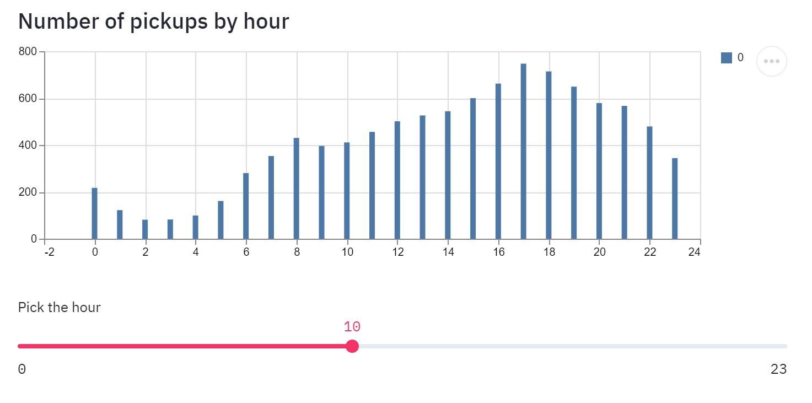
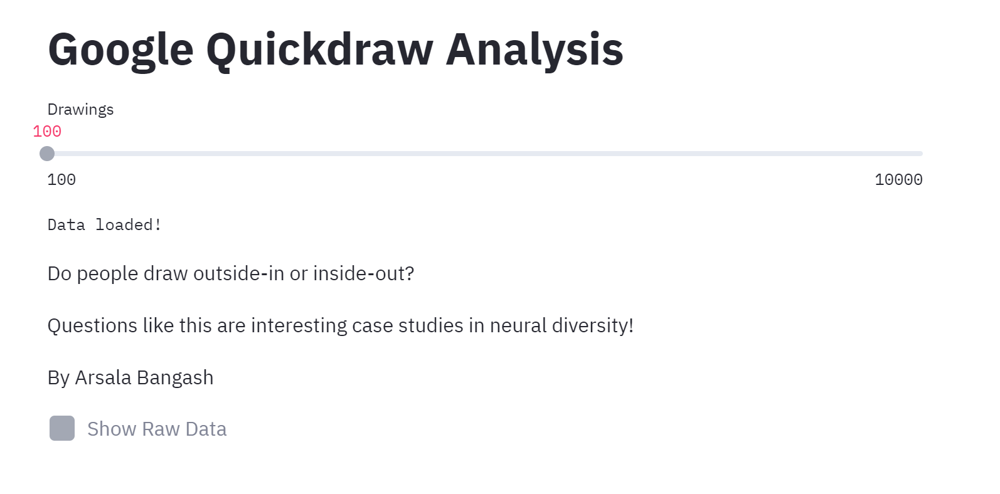
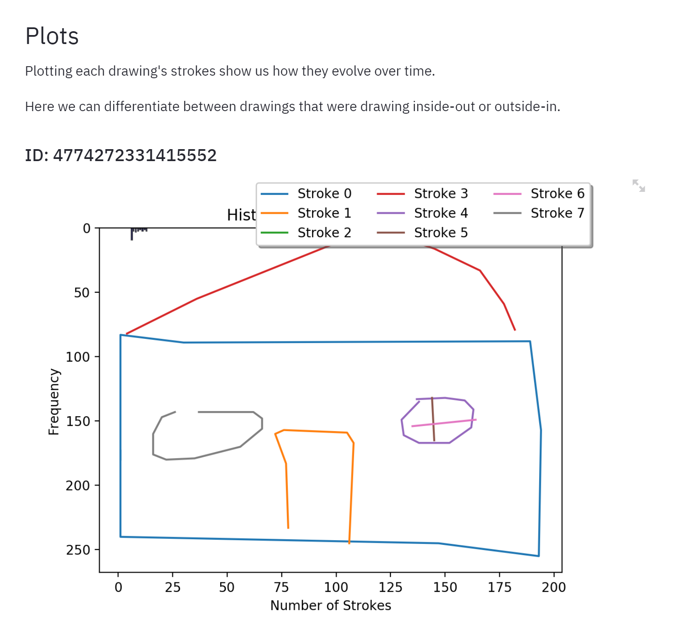

# Data Science With Streamlit Workshop
This workshop introduces you to Streamlit, an app framework for ML and Data Science, by working with Uber Pickups and Google Quickdraw Data.

### Getting Started
To get started with the workshop, we must install some dependencies. We require Python2.7.0/3.6.x or greater installed in your environment. 

Installing Streamlit:

`pip install streamlit`

As Streamlit comes with the `pandas` and `numpy` libraries, it is all you need to finish the Uber Pickups tutorial. For the Google Quickdraw tutorial we require a few more dependencies, all installed using `pip`:

`pip install ndjson`

`pip install plotly`

`pip install matplotlib`

### Uber Pickups 

This data exploration follows [this tutorial](https://streamlit.io/docs/tutorial/create_a_data_explorer_app.html) from the [streamlit docs](https://streamlit.io/docs/)

### Google Quickdraw

We'll analyze [data](https://github.com/googlecreativelab/quickdraw-dataset) from the [Google Quickdraw app](https://quickdraw.withgoogle.com/)

We'll look into whether users doodled their drawings starting with the outlining structure of the drawing or with its details. 

***

